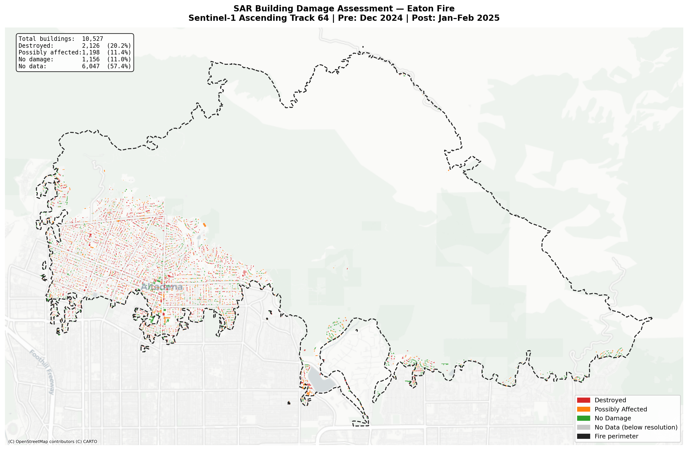
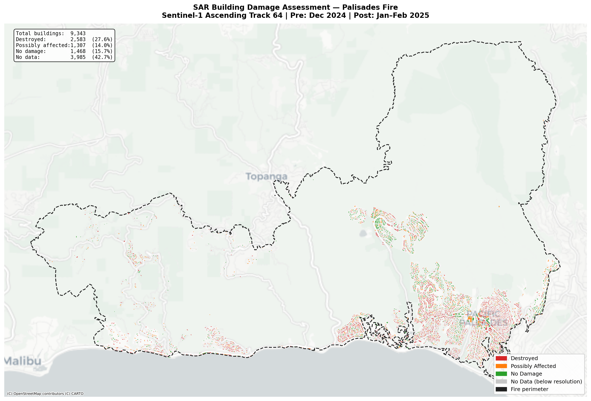
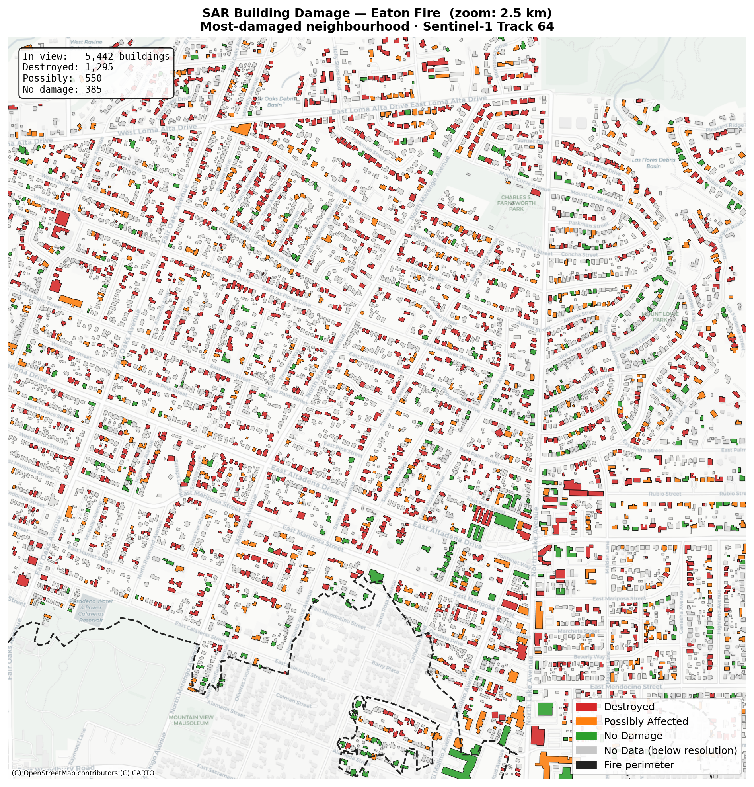
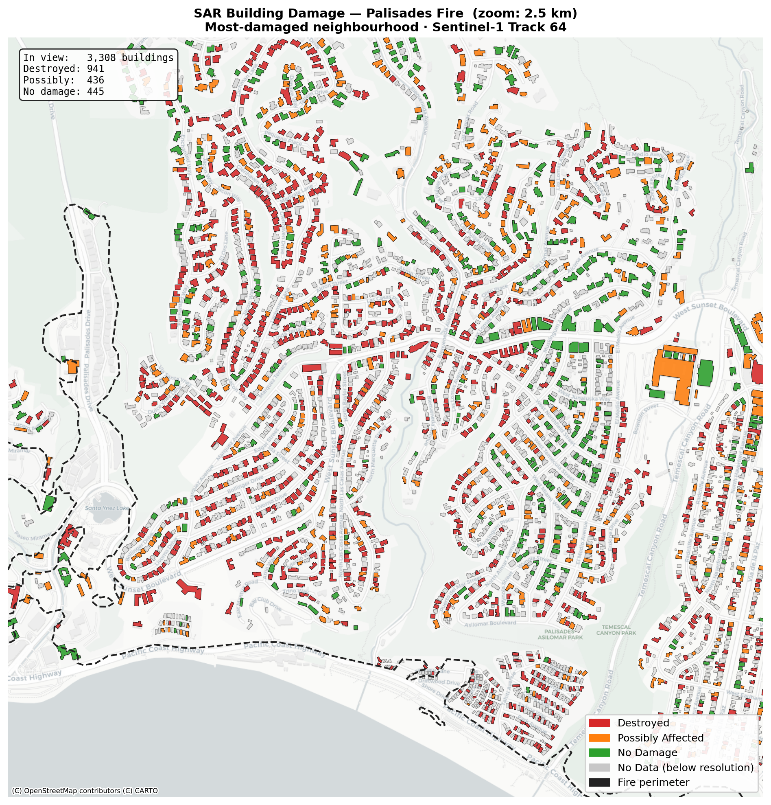
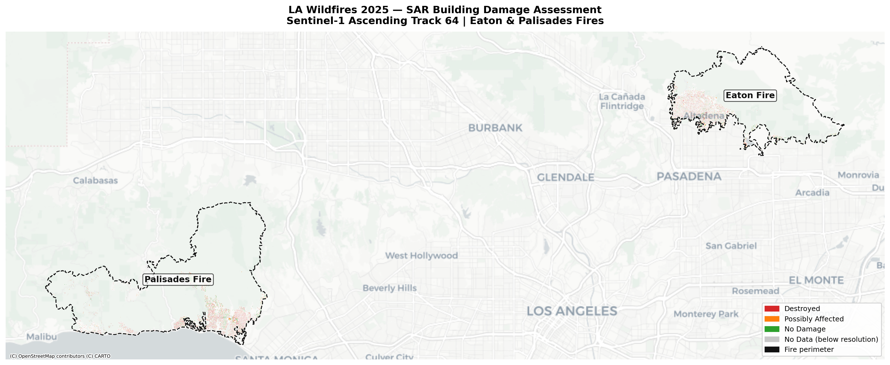
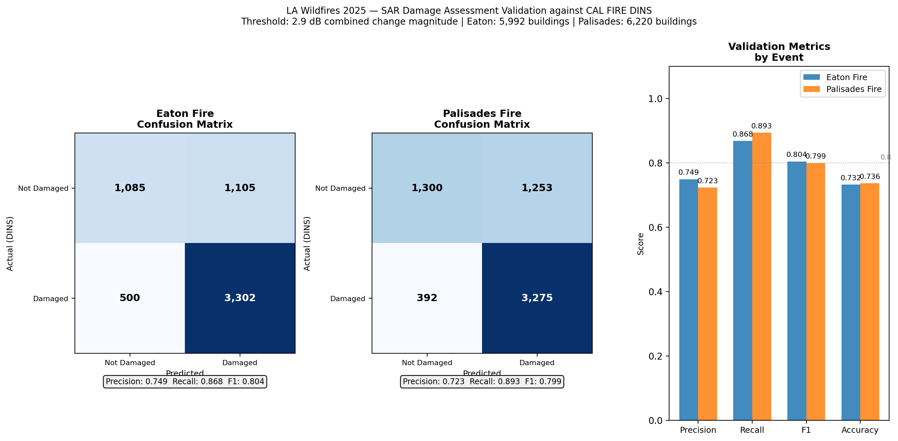
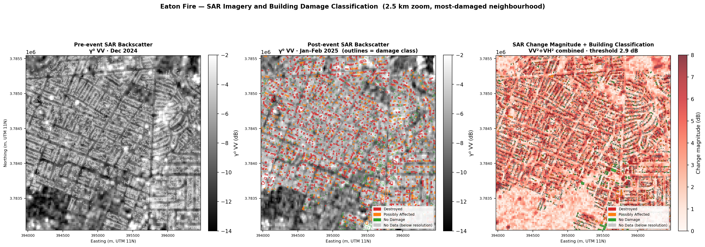
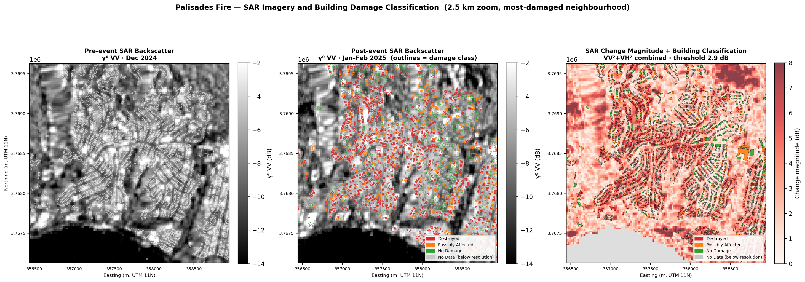
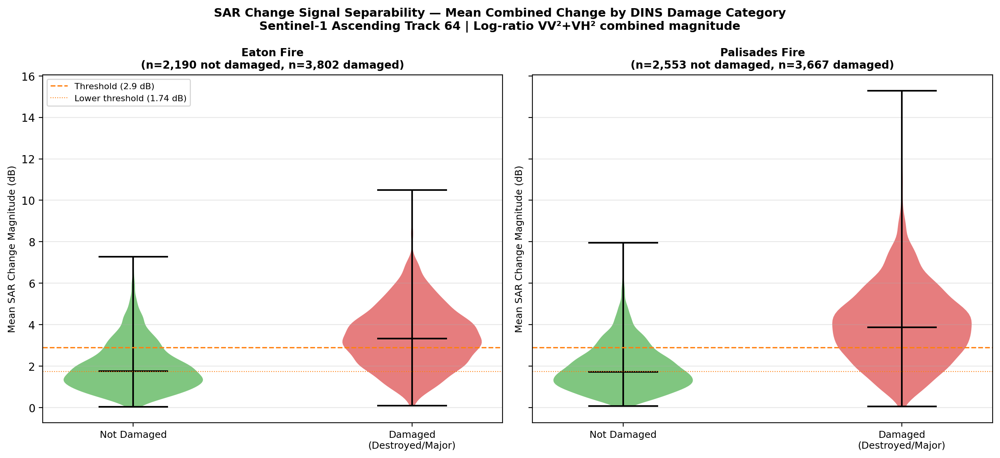

# LA Wildfires 2025 — Sentinel-1 SAR Building Damage Assessment

A production-grade SAR wildfire damage assessment pipeline using free and open Sentinel-1 imagery to detect building-level structural damage across the January 2025 Los Angeles wildfires (Eaton and Palisades fires). The pipeline is fully automated from raw scene download through to validated building-level damage classifications and is validated against CAL FIRE Damage Inspection (DINS) ground truth.

---

## Events Covered

| Fire | Ignition | Containment | Area (ha) | Buildings in Perimeter |
|------|----------|-------------|-----------|----------------------|
| Eaton | 7 Jan 2025 | 31 Jan 2025 | ~3,700 | 10,527 |
| Palisades | 7 Jan 2025 | 31 Jan 2025 | ~9,000 | 9,343 |

Both fires are among the most destructive in California history. The Eaton fire destroyed approximately 9,000 structures; the Palisades fire approximately 6,000.

---

## Results Summary

### Eaton Fire



| Damage Class | Count | % of Total |
|---|---|---|
| Destroyed | 2,126 | 20.2% |
| Possibly Affected | 1,198 | 11.4% |
| No Damage | 1,156 | 11.0% |
| No Data (below resolution) | 6,047 | 57.4% |

### Palisades Fire



| Damage Class | Count | % of Total |
|---|---|---|
| Destroyed | 2,583 | 27.7% |
| Possibly Affected | 1,307 | 14.0% |
| No Damage | 1,468 | 15.7% |
| No Data (below resolution) | 3,985 | 42.7% |

### Eaton Fire — Zoom (most-damaged neighbourhood, 2.5 km)



### Palisades Fire — Zoom (most-damaged neighbourhood, 2.5 km)



### Combined Overview



---

## Validation Against Ground Truth

Building damage classifications are validated against the CAL FIRE Damage Inspection System (DINS), which provides post-fire structural assessments for inspected properties. DINS records are spatially matched to building footprints (≤25 m) and binarised: structures rated Destroyed (>50%) or Major (26–50%) are treated as damaged; all others as not damaged.

Buildings with no SAR signal (`no_data` and `geometry_limited` classes) are **excluded** from the validation denominator. Retaining them and mapping them to "not damaged" would silently deflate the false-negative count — absence of signal is not evidence of absence of damage.

### Validation Metrics (threshold: 2.9 dB)



| Event | Precision | Recall | F1 | Accuracy | Validated on |
|-------|-----------|--------|----|----------|--------------|
| Eaton | 0.749 | 0.868 | 0.804 | 0.732 | 5,992 buildings |
| Palisades | 0.723 | 0.893 | 0.799 | 0.736 | 6,220 buildings |

F1 ≈ 0.80 for both events is consistent with published Sentinel-1 urban damage mapping results (UNOSAT, JRC, Copernicus EMS typically report F1 0.72–0.85 at 20m resolution). The asymmetry between precision and recall (recall notably higher at 87–89%) is an intentional outcome of threshold calibration: in an emergency response context, missing damage (false negative) carries a higher cost than a false alarm (false positive). The threshold was calibrated by sweeping 0.5–10.0 dB in 0.1 dB steps and selecting the F1-maximising value rather than using an arbitrary fixed threshold.

### SAR Imagery — Pre / Post / Change (Eaton Fire)



The three panels show the raw SAR signal the algorithm works from. Left: pre-event gamma-nought VV backscatter (Dec 2024) with building outlines in white. Centre: post-event backscatter (Jan–Feb 2025) with building outlines coloured by damage class — red outlines mark structures that disappeared or were significantly altered. Right: combined VV+VH change magnitude overlaid with filled building polygons, showing the direct relationship between the SAR signal and the classification output.

### SAR Imagery — Pre / Post / Change (Palisades Fire)



The Palisades area shows characteristic SAR terrain effects — the bright/dark banding in the canyon areas reflects geometric distortion from the coastal bluff topography. Damaged residential areas along the Pacific Palisades coast are clearly identified in the change panel despite the more complex terrain.

### SAR Change Signal Separability



The violin plots show the distribution of mean SAR combined change magnitude (dB) for buildings ground-truthed as damaged versus not damaged. The distributions are clearly shifted but overlapping — this overlap is the fundamental limit of 20m resolution SAR for individual building classification, and directly explains the ~25% false positive rate. The threshold (2.9 dB, orange dashed line) sits at the crossing point of the two distributions, confirming the calibration is geometrically reasonable.

---

## SAR Methodology

### Scene Selection

**Sensor:** Sentinel-1A IW GRD, dual-pol VV+VH, ascending orbit, Track 64  
**Pre-event composite:** 3 scenes — 4 Dec 2024, 16 Dec 2024, 28 Dec 2024  
**Post-event composite:** 3 scenes — 21 Jan 2025, 2 Feb 2025, 14 Feb 2025

Track 64 was selected over the alternative ascending Track 137 following discovery that Track 137's IW3 sub-swath far-range burst boundary ends at x ≈ 392,200m UTM 11N — placing the entire Eaton fire perimeter (starting at x = 392,938m) in a no-data zone. Track 64 places both fires in the swath interior with full valid coverage.

The first post-event acquisition date was set to 21 January (14 days post-ignition) rather than using the 9 January overpass (2 days post-ignition). This avoids the active suppression phase when fire retardant, emergency vehicles, and debris disturbance would introduce confounding backscatter changes unrelated to structural damage. A 14–38 day post-fire window is standard for SAR NatCat structural assessment.

### Radiometric Terrain Correction (RTC)

Scenes are processed to gamma-nought (γ⁰) backscatter using pyroSAR/SNAP with:
- Thermal noise removal (`removeS1ThermalNoise=True`)
- Border noise removal (`removeS1BorderNoise=True`)
- Terrain flattening
- SRTM 1 arcsec DEM
- 20m output spacing, EPSG:32611 (UTM Zone 11N)
- Local Incidence Angle (LIA) exported alongside each scene

### Composite Strategy

Pre and post composites are built from 3 scenes each per polarisation (VV, VH).

Two critical alignment decisions:
1. **Single master reference grid.** All four composites (pre/post × VV/VH) are reprojected to a single master spatial grid established from the first pre-event VV scene. Without this, floating-point rounding differences between scene origins produce a ~136m (~7 pixel) spatial offset between pre and post arrays, introducing systematic change artefacts.
2. **Median stacking.** `nanmedian` is used instead of `nanmean`. With 3 scenes, the median equals the middle value, discarding any single anomalous acquisition (e.g. a rainfall event causing wet-soil backscatter spikes in one scene). This is the standard approach in multi-temporal SAR compositing.

### Change Detection

Log-ratio change detection in dB space (positive values indicate decreased backscatter post-fire, consistent with structural loss):

```
ΔdB_VV = post_VV - pre_VV
ΔdB_VH = post_VH - pre_VH
combined_change = sqrt(ΔVV² + ΔVH²)
```

The combined VV+VH magnitude is used for building classification because:
- VV is more sensitive to surface roughness changes (rubble, debris)
- VH is more sensitive to volume scattering (structural elements, double-bounce)
- Combining both maximises separability and reduces polarisation-specific noise

### Building-Level Classification

Building footprints are sourced from the [Microsoft Building Footprints](https://github.com/microsoft/GlobalMLBuildingFootprints) dataset (California, 836,594 buildings in the combined bounding box). Footprints are filtered to within fire perimeters before processing.

Zonal statistics (mean combined change per building polygon) are extracted using `rasterstats`. Default centre-point mode is used — pixels are attributed to a building only if the pixel centroid falls within the polygon. This is the standard industry approach; the alternative (`all_touched=True`) would include surrounding pixels that are predominantly street or adjacent buildings, contaminating the building-level measurement.

Damage classification thresholds (calibrated):
| Class | Criterion |
|-------|-----------|
| Destroyed | mean_change ≥ 2.9 dB |
| Possibly Affected | mean_change ≥ 1.74 dB and < 2.9 dB |
| No Damage | mean_change < 1.74 dB |
| No Data | no pixel centroid within footprint |

The threshold (2.9 dB) was calibrated by F1-maximisation across both events using the matched DINS building set — not fixed arbitrarily. The lower bound uses a 0.6× ratio to the upper threshold, preserving a two-class detection window consistent with the DINS Destroyed/Major split.

### Local Incidence Angle Flagging

Buildings where the mean Local Incidence Angle (LIA) from the RTC processing exceeds 60° are flagged as `geometry_limited` rather than classified. Above this threshold, the terrain faces significantly away from the radar illumination — the building may sit in a shadow or layover zone where backscatter is geometrically distorted and unreliable for damage assessment. In the study area (suburban alluvial fan and coastal bluff terrain), no buildings exceeded this threshold, consistent with the moderate slope angles in both fire areas.

### Validation Design

The validation follows standard SAR damage assessment practice:
- Spatial matching: each DINS record joined to its nearest building footprint (≤25 m)
- Buildings classified as `no_data` or `geometry_limited` are excluded from the validation denominator — absence of SAR signal is not evidence of the absence of damage
- Binary DINS threshold: "Destroyed (>50%)" and "Major (26–50%)" categories map to damaged=1; all others to damaged=0
- Threshold calibrated by F1-maximisation sweep then written back to config for a final buildings re-run, ensuring output GeoJSONs are consistent with the validated threshold

---

## Data Sources

| Dataset | Source | Notes |
|---------|--------|-------|
| Sentinel-1 IW GRD | [CDSE (Copernicus Data Space Ecosystem)](https://dataspace.copernicus.eu/) | Free, requires account |
| Microsoft Building Footprints | [Microsoft GlobalMLBuildingFootprints](https://github.com/microsoft/GlobalMLBuildingFootprints) | California.geojson (~3.5 GB) |
| CAL FIRE DINS | [CAL FIRE](https://www.fire.ca.gov/) | Post-fire structure inspections |
| SRTM 1 arcsec DEM | Auto-downloaded via SNAP | Used for RTC terrain correction |
| Fire perimeters | [NIFC / CAL FIRE](https://www.nifc.gov/) | GeoJSON format |

---

## Pipeline Architecture

```
scripts/run_processing.py       Download SAFE files from CDSE + SNAP RTC processing
        │
        ▼
src/pipeline/composite.py       Build pre/post median composites (VV, VH)
        │
        ▼
src/pipeline/change.py          Log-ratio change detection, burn perimeter vectorisation
        │
        ▼
src/pipeline/buildings.py       Zonal statistics, damage classification, LIA flagging
        │
        ▼
src/pipeline/validate.py        DINS matching, threshold calibration, metrics
        │
        ▼
scripts/visualise.py            Maps, confusion matrices, signal separability figures
```

All stages are individually re-runnable. Skip logic prevents re-processing already-complete outputs. Run from project root:

```bash
python -m scripts.run_processing      # ~4–6 hours (SNAP processing)
python -m src.pipeline.composite
python -m src.pipeline.change
python -m src.pipeline.buildings      # ~15–20 min (3.5 GB building footprint load)
python -m src.pipeline.validate
python -m scripts.visualise
```

If validate.py writes a new calibrated threshold, re-run buildings then validate once more:
```bash
python -m src.pipeline.buildings   # delete data/vectors/*.geojson first
python -m src.pipeline.validate
```

---

## Key Limitations

**Resolution floor (~50% no_data rate).** Sentinel-1 at 20m spacing means each pixel covers ~400 m². Zonal statistics using pixel-centroid mode requires at least one pixel centre to fall within the building polygon. Smaller residential structures, outbuildings, and garages may have no pixel centre within their footprint and therefore cannot be classified. This is an inherent resolution limitation of free Sentinel-1 data, not a methodological flaw — it is documented in line with standard UNOSAT/Copernicus EMS practice. Sub-metre commercial SAR (e.g. ICEYE Spotlight, Capella) would reduce this substantially.

**Single-polarisation change signal.** The log-ratio detects changes in radar backscatter. Not all structural damage produces a detectable backscatter change — fires that leave a concrete slab intact (typical for light-frame residential in wildfires) may show less change than expected. Conversely, soil moisture changes, debris clearance operations, or emergency vehicle activity during the post-event window can produce false positives in non-fire areas.

**DINS validation completeness.** DINS records represent structures that were inspected, which skews toward accessible road-adjacent buildings. Remote or inaccessible structures may be absent from the ground truth. This does not invalidate the validation but should be noted when interpreting precision/recall numbers.

**Single orbit geometry.** Only ascending Track 64 was used. Adding a descending track (Track 71 is available for this area) would provide a complementary look angle, potentially classifying buildings that are in ascending-orbit shadow and vice versa. This would be a natural extension for operational deployment.

---

## Dependencies

```
pyroSAR==0.36.2
rasterio
geopandas
rasterstats
numpy
scipy
shapely
matplotlib
contextily
boto3
python-dotenv
pyyaml
gdal==3.12.2
```

Python 3.14 on Windows. ESA SNAP GPT must be on PATH. All scene processing runs via pyroSAR's `geocode()` interface to SNAP. Install with:

```bash
python -m pip install -r requirements.txt
```

CDSE credentials required in `.env`:
```
CDSE_USER=your_email
CDSE_PASSWORD=your_password
```

---

## Config

All scene dates, thresholds, and paths are defined in `config/pipeline_config.yaml`. The calibrated change detection threshold is written back to this file automatically by `validate.py` after threshold calibration.

---

## Repository Structure

```
LAwildfireSAR/
├── config/
│   └── pipeline_config.yaml       Scene dates, thresholds, paths
├── data/
│   ├── external/                  Fire perimeters, DINS, building footprints
│   ├── raw/                       Downloaded SAFE zip files
│   ├── rtc/                       SNAP-processed GeoTIFFs (VV, VH, LIA)
│   ├── analysis/                  Composites, change rasters
│   ├── vectors/                   Building damage GeoJSONs
│   └── validation/                Validation summary JSON
├── outputs/
│   └── figures/                   All visualisation outputs
├── scripts/
│   ├── run_processing.py          Download + SNAP orchestration
│   ├── visualise.py               Figure generation
│   └── search_all_tracks.py       CDSE track search utility
├── src/
│   ├── pipeline/
│   │   ├── composite.py
│   │   ├── change.py
│   │   ├── buildings.py
│   │   └── validate.py
│   └── utils/
│       └── config.py
└── README.md
```

---

*Built with Sentinel-1 open data from the Copernicus Data Space Ecosystem. Fire perimeters and DINS ground truth from CAL FIRE. Building footprints from Microsoft GlobalMLBuildingFootprints.*
